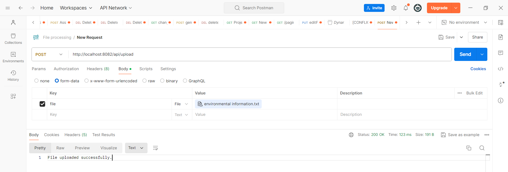
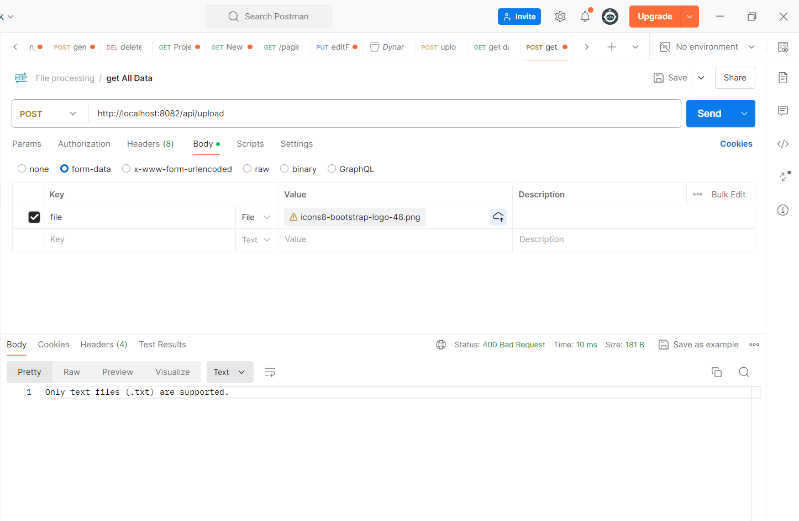
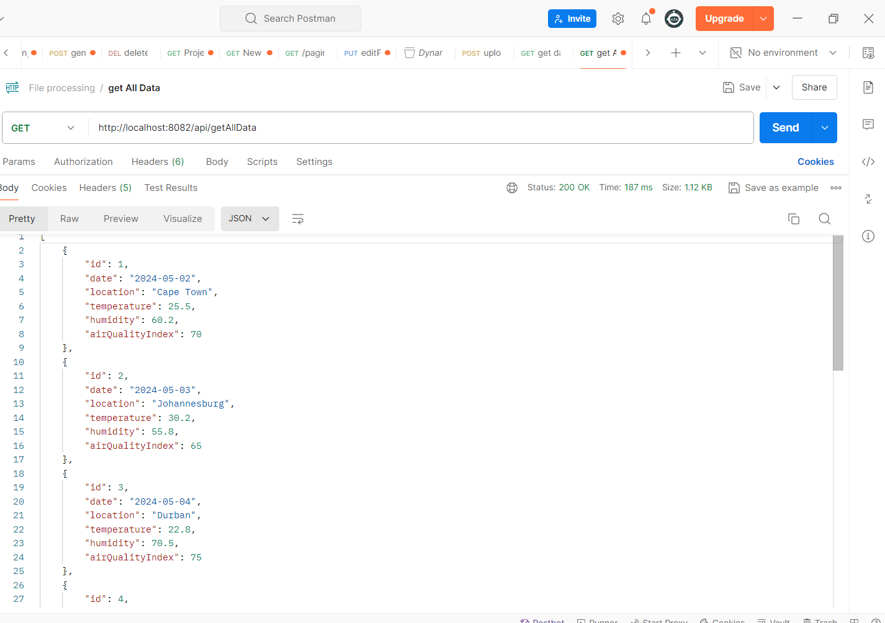
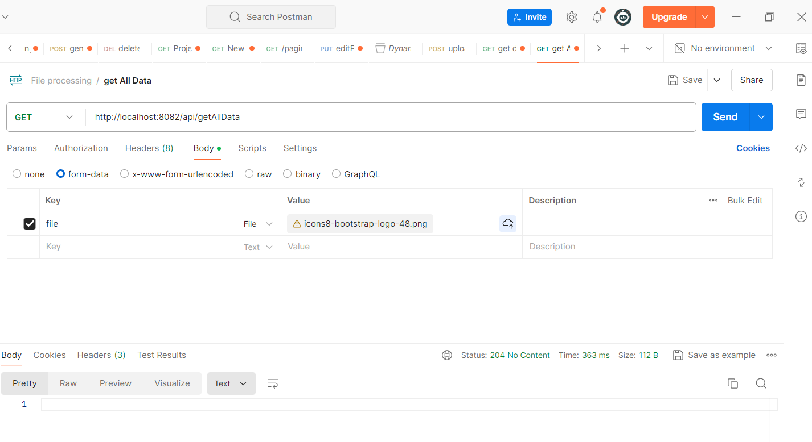
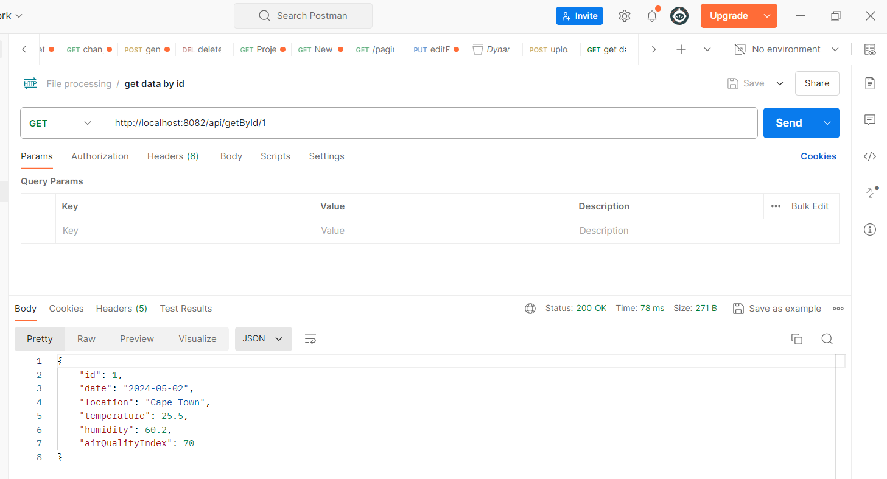
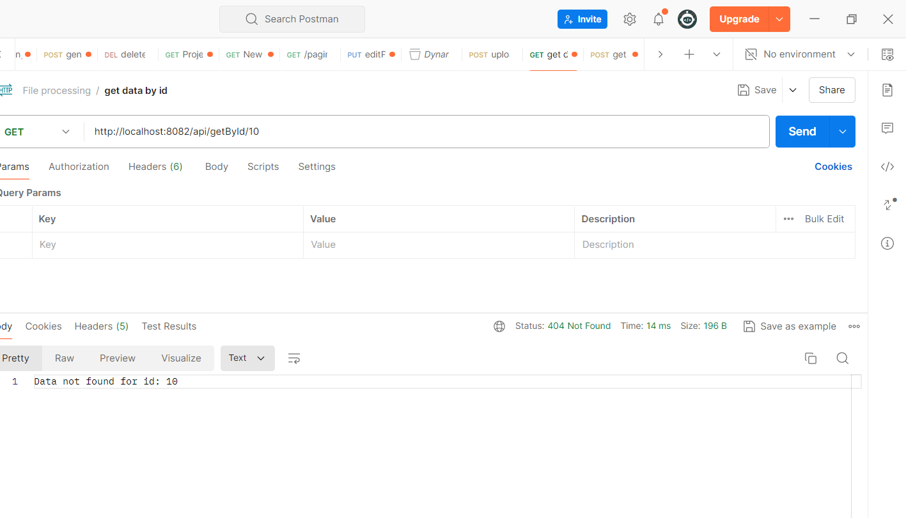
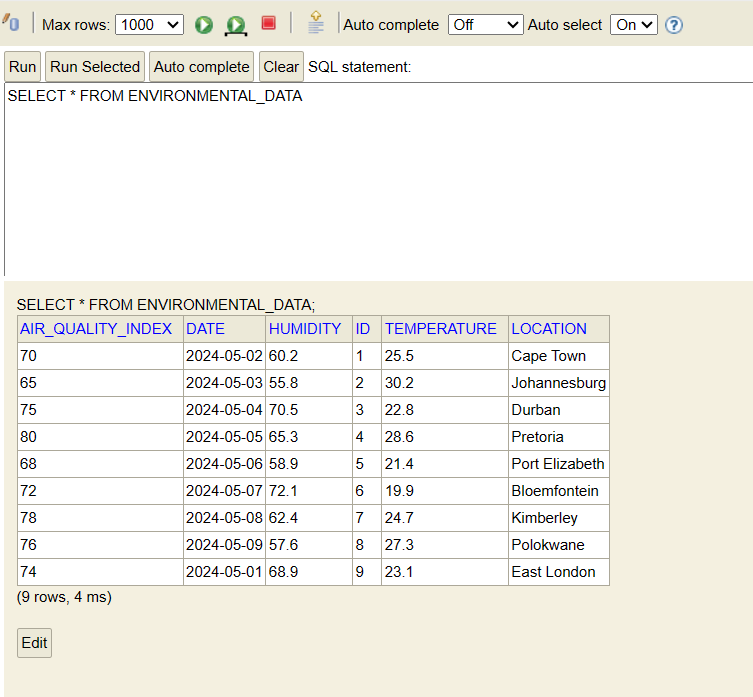

# FileProcessing Documentation
 a leading environmental consulting firm, aims to develop a RESTful API to
 facilitate file data processing for their clients. The API will enable clients to upload text files
 containing environmental data for analysis and retrieve processed results through simple
 API requests and save the data in the database. As a software developer tasked with
 building this API, you need to design and implement a solution that meets the
 requirements outlined by Enviro365.

# Endpoints

# Description
This endpoint handles file uploads. It accepts a multipart file as input and processes it accordingly. Upon successful upload, it returns a success message. If there are any errors during the upload process, appropriate error messages are returned.

1.POST http://localhost:8082/api/upload

# Request
Method: POST

URL: http://localhost:8082/api/upload

Request Body:

file (multipart): The file to be uploaded.

# Responses
Success Response (200 OK):

Body: "File uploaded successfully."

Description: Indicates that the file was uploaded successfully.

Error Responses:
Internal Server Error (500):
Body: "Failed to process the uploaded file."
Description: Indicates that there was an internal server error while processing the uploaded file.

Bad Request (400):

Body: (Only text files (.txt) are supported.)

Description: Indicates that there was a bad request,in cases of invalid file format.

Description

This endpoint retrieves all environmental data stored in the system. It returns a list of EnvironmentalData objects. If there are no data available, it returns a 204 (NO_CONTENT) response. In case of any errors during the data retrieval process, it returns a 500 (INTERNAL_SERVER_ERROR) response.

2.GET http://localhost:8082/api/getAllData

# Request

Method: GET

URL: http://localhost:8082/api/getAllData

#  Responses

Success Responses:

200 OK:

Body: A JSON array containing a list of EnvironmentalData objects.

Description: Returns the list of environmental data.

Error Responses:

204 NO CONTENT:

Body: (1)

Description: Body returns 1 if there is no conent , else it returns the list of environmental .

500 INTERNAL SERVER ERROR:

Body: (No content)

Description: Indicates that there was an internal server error while retrieving the data.

Description

This endpoint retrieves environmental data based on the provided ID. It returns the EnvironmentalData object corresponding to the specified ID if found. If no data is found for the given ID, it returns a 404 (NOT_FOUND) response. In case of any errors during the data retrieval process, it returns a 500 (INTERNAL_SERVER_ERROR) response.

3.GET http://localhost:8082/api/getById/1

# Request
Method: GET

URL:  http://localhost:8082/api/getById/{id}

{id}: The unique identifier of the environmental data to be retrieved.

# Parameters

id (path variable): The unique identifier of the environmental data.

# Responses

Success Response (200 OK):

Body: The JSON representation of the retrieved EnvironmentalData object.

Description: Returns the environmental data corresponding to the provided ID.

Error Responses:

404 NOT FOUND:

Body: "Data not found for id: {id}"

Description: Indicates that no data was found for the provided ID.

500 INTERNAL SERVER ERROR:

Body: (No content)

Description: Indicates that there was an internal server error while retrieving the data.

# H2 Database

